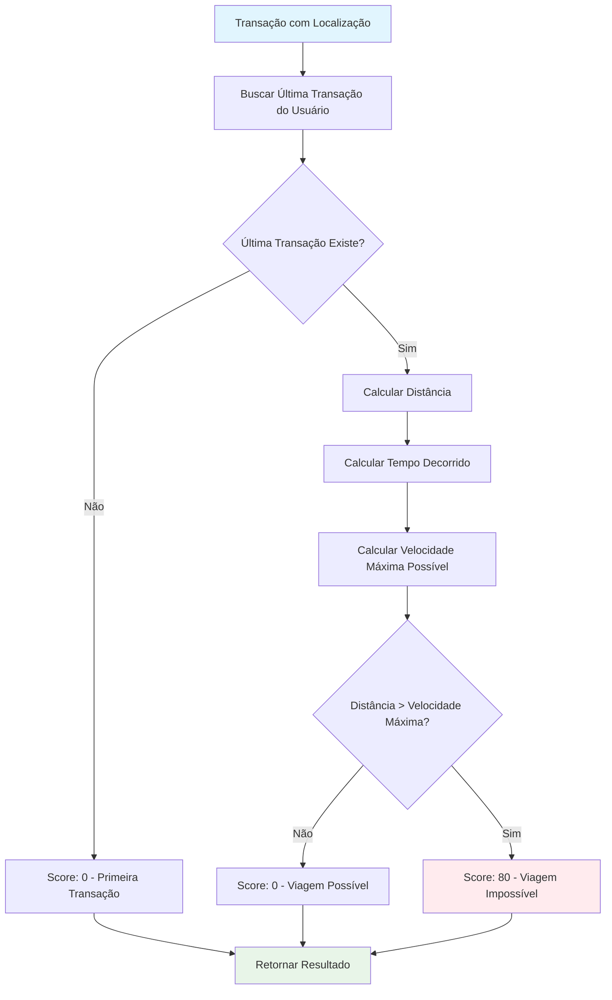
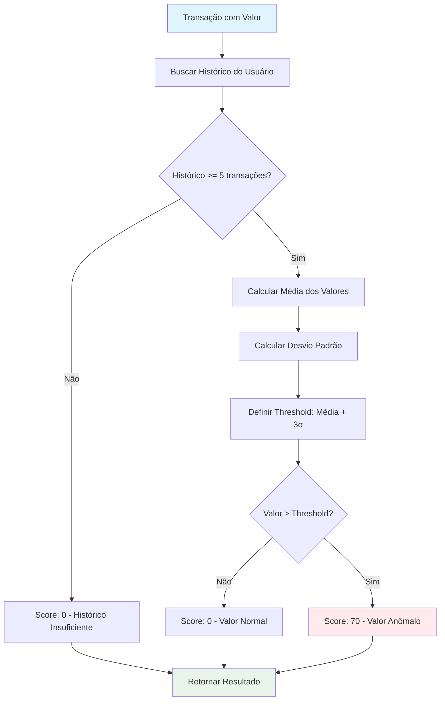
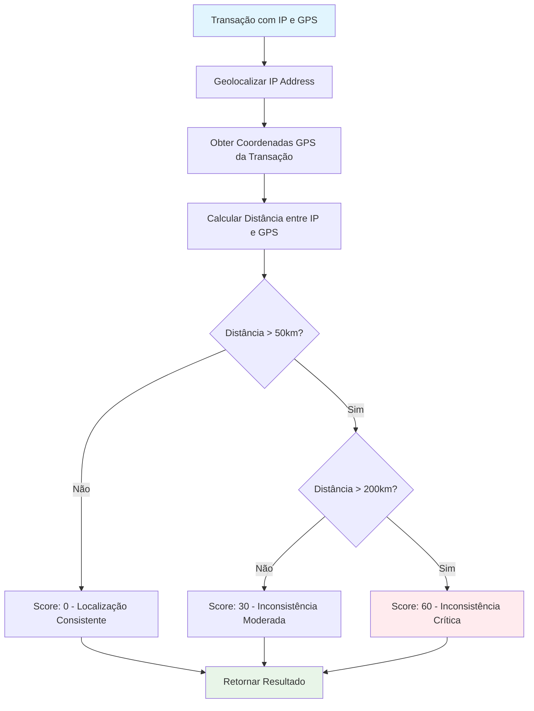
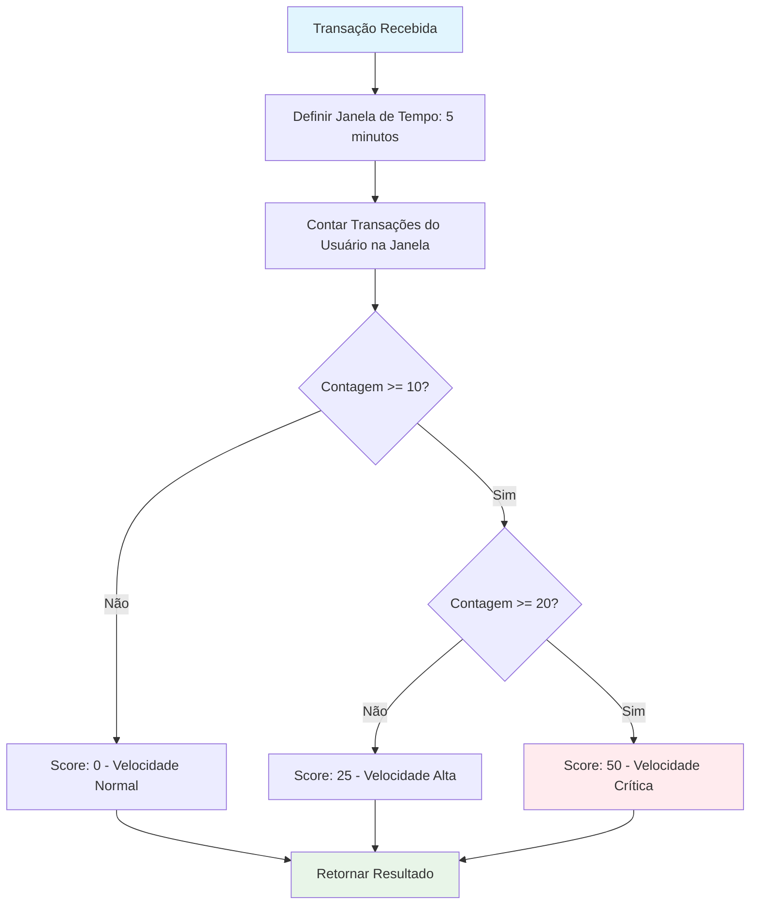
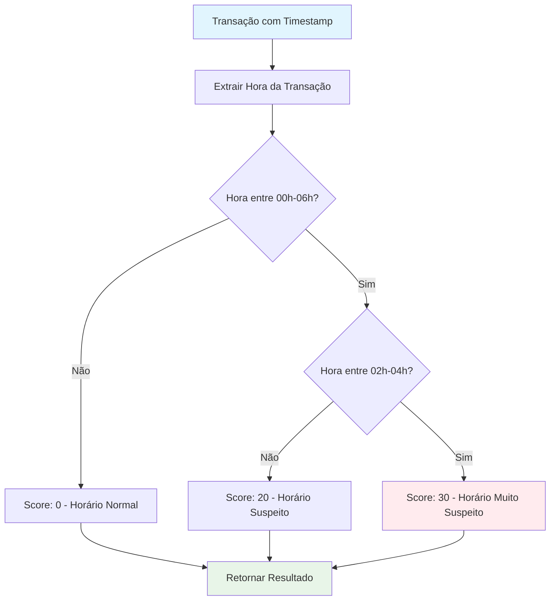
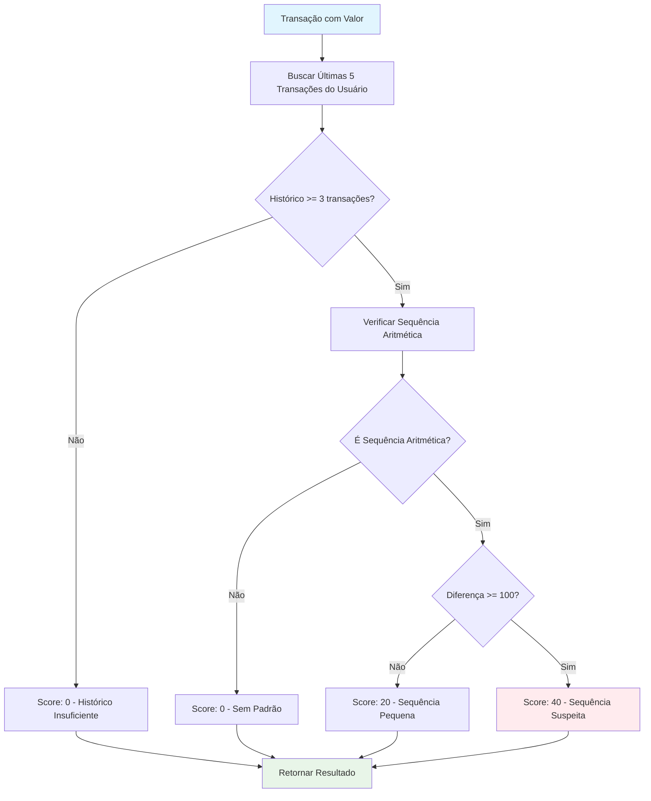
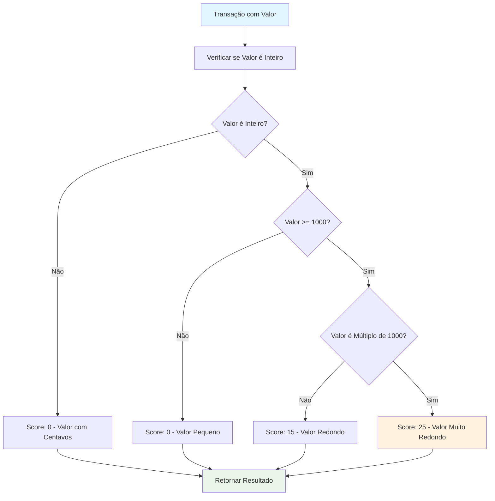
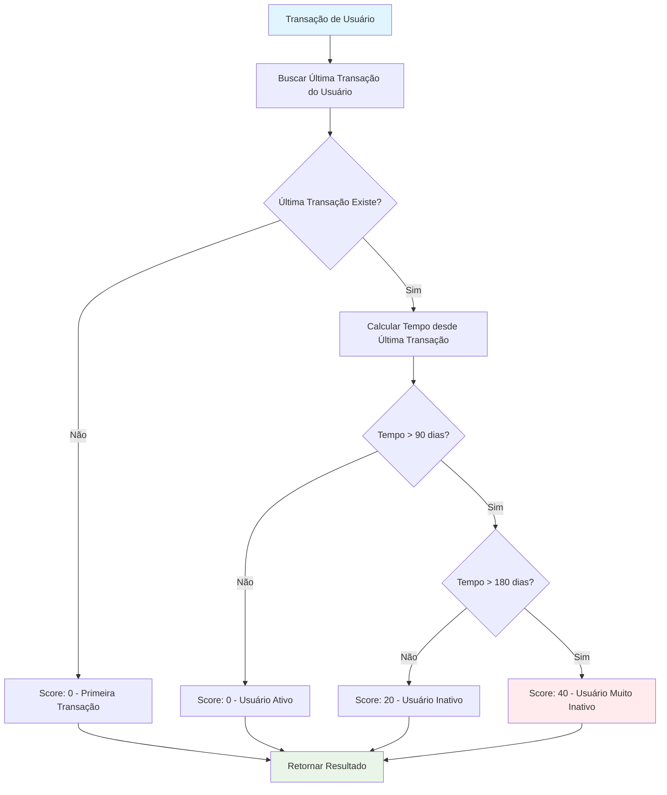
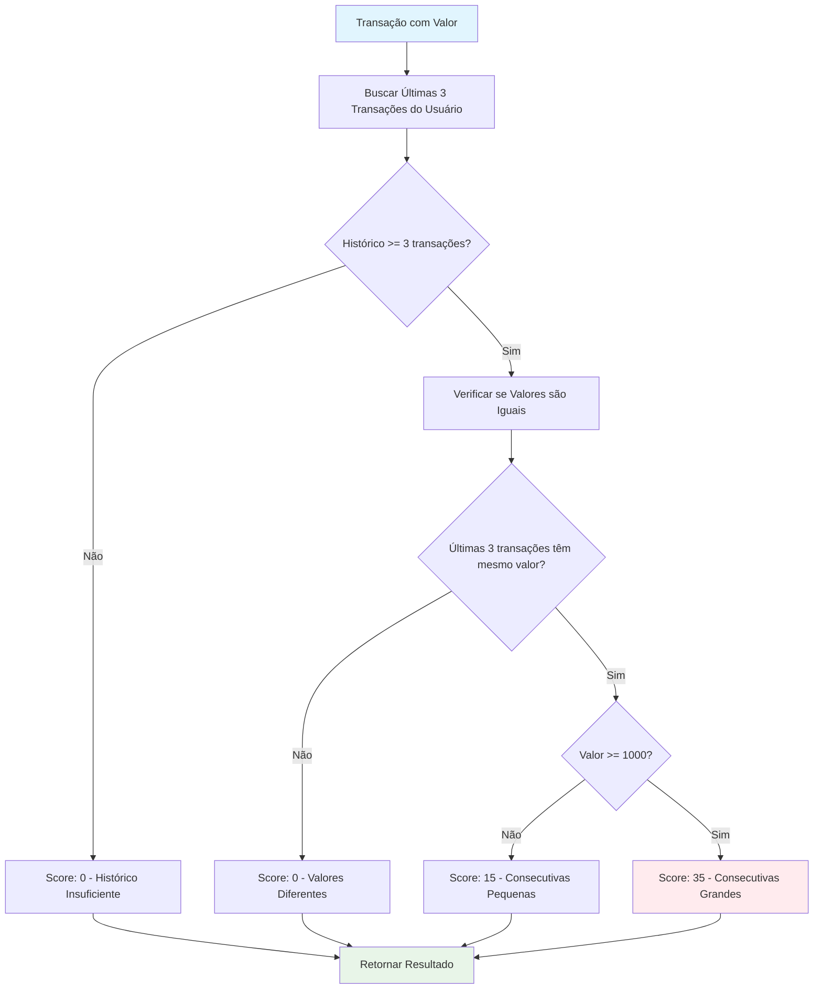

# 🚨 Cenários de Detecção de Fraude

Este documento detalha todos os cenários de detecção de fraude implementados no sistema antifraude, organizados por complexidade e tempo de implementação.

## 📊 Diagramas de Detecção por Cenário

### 🔴 Cenário 1: Viagem Impossível


### 📊 Cenário 2: Valor Anômalo


### 📱 Cenário 3: Dispositivo Desconhecido



### ⚡ Cenário 4: Velocidade de Transações


### 🕐 Cenário 5: Horário Suspeito


### 🔢 Cenário 6: Sequência de Valores


### 🌍 Cenário 7: Localização Inconsistente


### 💰 Cenário 8: Valor Redondo


### 👤 Cenário 9: Usuário Inativo


### 🔄 Cenário 10: Transações Consecutivas


## 📊 Sistema de Pontuação

```go
type RiskScore struct {
    BaseScore    float64 `json:"base_score"`
    Triggers     []Trigger `json:"triggers"`
    FinalScore   float64 `json:"final_score"`
    RiskLevel    RiskLevel `json:"risk_level"`
}

type Trigger struct {
    RuleID       string  `json:"rule_id"`
    RuleName     string  `json:"rule_name"`
    Score        float64 `json:"score"`
    Description  string  `json:"description"`
}
```

---

**💡 Dica:** Comece implementando os cenários mais simples e vá adicionando complexidade gradualmente. Isso garante que você tenha um sistema funcional desde o início do hackathon!
