# antifraud

# 🎯 Objetivo

Desenvolver um sistema de detecção de fraude em tempo real que analisa transações usando regras de negócio e padrões de comportamento, alertando sobre atividades suspeitas instantaneamente.

# 📋 Contexto

Sistemas de detecção de fraude precisam:

- Analisar transações em tempo real (menos de 50ms)
- Aplicar regras de negócio para detectar fraudes
- Calcular pontuações de risco dinâmicas
- Enviar alertas instantâneos
- Manter histórico de padrões suspeitos
- Suportar milhares de transações por segundo

# 🏗 Arquitetura Proposta

O sistema utiliza um fluxo de análise com fila de prioridade:

- **Fluxo de Transações** → **Pipeline de Análise de Fraude**
- **Motor de Regras** + **Calculadora de Pontuação** + **Avaliador de Risco**
- **Fila de Prioridade** para organizar alertas
- **Alertas em Tempo Real** via WebSocket/HTTP
- **Histórico de Transações** em PostgreSQL

## 📊 Diagrama de Arquitetura

```mermaid
graph TD
    A[Cliente] --> B[API Gateway]
    B --> C[POST /analyze]
    
    C --> D[Transaction Receiver]
    D --> E[Worker Pool]
    
    E --> F[Motor de Regras]
    F --> G[Calculadora de Pontuação]
    G --> H[Avaliador de Risco]
    
    H --> I{Score >= 60?}
    I -->|Não| J[LOW/MEDIUM - Aprovar]
    I -->|Sim| K[HIGH/CRITICAL - Bloquear]
    
    J --> L[Fila de Prioridade]
    K --> L
    
    L --> M[WebSocket Alerts]
    L --> N[HTTP Response]
    
    D --> O[PostgreSQL]
    O --> P[Histórico de Transações]
    O --> Q[Cache de Dispositivos]
    O --> R[Padrões de Usuário]
    
    S[GET /alerts] --> L
    T[GET /stats] --> O
    U[WebSocket /ws/alerts] --> M
    
    style A fill:#e1f5fe
    style F fill:#fff3e0
    style G fill:#f3e5f5
    style H fill:#e8f5e8
    style K fill:#ffebee
    style M fill:#e8f5e8
    style O fill:#f1f8e9
```



## Cenários de Detecção
- **Cenário 1:** Viagem Impossível (transações em locais muito distantes)
- **Cenário 2:** Valor Anômalo (transações muito acima do padrão)
- **Cenário 3:** Dispositivo Desconhecido (novo dispositivo suspeito)
- **Cenário 4:** Velocidade de Transações (muitas transações em pouco tempo)
- **Cenário 5:** Horário Suspeito (transações em horários atípicos)
- **Cenário 6:** Sequência de Valores (padrões suspeitos de valores)
- **Cenário 7:** Localização Inconsistente (IP vs GPS não batem)
- **Cenário 8:** Valor Redondo (transações com valores "perfeitos")
- **Cenário 9:** Usuário Inativo (retorno após muito tempo)
- **Cenário 10:** Transações Consecutivas (mesmo valor repetido)

> 📋 **Detalhes Completos:** Veja [FRAUD_SCENARIOS.md](./FRAUD_SCENARIOS.md) para implementação detalhada, diagramas e exemplos de código de cada cenário.

# 🔧 Estruturas de Dados Principais

## Transaction Models

```go
type Transaction struct {
    ID            string            `json:"id" db:"id"`
    UserID        string            `json:"user_id" db:"user_id"`
    Amount        float64           `json:"amount" db:"amount"`
    Currency      string            `json:"currency" db:"currency"`
    Location      TransactionLocation `json:"location" db:"location"`
    DeviceInfo    DeviceInfo        `json:"device_info" db:"device_info"`
    Timestamp     time.Time         `json:"timestamp" db:"timestamp"`
    Type          TransactionType   `json:"type" db:"type"`
    MerchantInfo  MerchantInfo      `json:"merchant_info" db:"merchant_info"`
}

type TransactionLocation struct {
    Country     string  `json:"country" db:"country"`
    City        string  `json:"city" db:"city"`
    Latitude    float64 `json:"latitude" db:"latitude"`
    Longitude   float64 `json:"longitude" db:"longitude"`
    IPAddress   string  `json:"ip_address" db:"ip_address"`
}

type DeviceInfo struct {
    DeviceID    string `json:"device_id" db:"device_id"`
    Platform    string `json:"platform" db:"platform"`
    AppVersion  string `json:"app_version" db:"app_version"`
    UserAgent   string `json:"user_agent" db:"user_agent"`
    IsKnown     bool   `json:"is_known" db:"is_known"`
}
```

## Modelos de Análise de Fraude

```go
type FraudAnalysis struct {
    TransactionID string             `json:"transaction_id" db:"transaction_id"`
    RiskScore     float64            `json:"risk_score" db:"risk_score"`
    RiskLevel     RiskLevel          `json:"risk_level" db:"risk_level"`
    Triggers      []DetectionTrigger `json:"triggers" db:"triggers"`
    Action        FraudAction        `json:"action" db:"action"`
    AnalyzedAt    time.Time          `json:"analyzed_at" db:"analyzed_at"`
}

type DetectionTrigger struct {
    RuleID      string  `json:"rule_id"`
    RuleName    string  `json:"rule_name"`
    Score       float64 `json:"score"`
    Confidence  float64 `json:"confidence"`
    Description string  `json:"description"`
}

type RiskLevel string
const (
    LOW    RiskLevel = "LOW"
    MEDIUM RiskLevel = "MEDIUM"
    HIGH   RiskLevel = "HIGH"
    CRITICAL RiskLevel = "CRITICAL"
)
```

## Priority Queue (Min-Heap)

```go
type Alert struct {
    ID          string      `json:"id"`
    Priority    int         `json:"priority"`    // Lower = Higher Priority
    RiskScore   float64     `json:"risk_score"`
    Transaction Transaction `json:"transaction"`
    Analysis    FraudAnalysis `json:"analysis"`
    CreatedAt   time.Time   `json:"created_at"`
}

type AlertHeap []*Alert

func (h AlertHeap) Len() int           { return len(h) }
func (h AlertHeap) Less(i, j int) bool { return h[i].Priority < h[j].Priority }
func (h AlertHeap) Swap(i, j int)      { h[i], h[j] = h[j], h[i] }
// ... Push/Pop implementation
```

# 📈 Endpoints da API

## Endpoints Principais

- **POST /analyze** - Analisar transação
- **GET /alerts** - Listar alertas ativos
- **GET /risk/{transactionId}** - Pontuação de risco específica
- **GET /patterns/{userId}** - Padrões do usuário
- **POST /rules** - Configurar regras
- **GET /stats** - Estatísticas de fraude
- **WebSocket /ws/alerts** - Fluxo de alertas em tempo real
- **GET /health** - Verificação de saúde do sistema

# ✅ Funcionalidades a Implementar

## Funcionalidades Principais

- **Análise em Tempo Real**
    - Processamento de transações em menos de 50ms
    - Aplicação paralela de regras de negócio
    - Cálculo dinâmico de pontuações de risco
- **Motor de Regras de Fraude**
    - Regras personalizáveis por tipo de transação
    - Combinação de múltiplos fatores de risco
    - Limites ajustáveis para cada regra
- **Sistema de Alertas Prioritários**
    - Fila de prioridade para organizar alertas
    - Alertas categorizados por nível de risco
    - Notificações em tempo real
- **Reconhecimento de Padrões**
    - Histórico de comportamento do usuário
    - Detecção de transações anômalas
    - Análise de tendências de gastos

## Funcionalidades Avançadas

- **Análise Geográfica**
    - Cálculo de distâncias entre transações
    - Detecção de viagens impossíveis
    - Verificação de fusos horários
- **Identificação de Dispositivos**
    - Controle de dispositivos conhecidos
    - Análise de mudanças suspeitas
    - Nível de confiança do dispositivo

# 🧪 Casos de Teste

## Teste 1: Viagem Impossível
*Detectar transações em locais muito distantes em pouco tempo*

```shell
# Transação em São Paulo
curl -X POST http://localhost:8888/analyze \
  -H "Content-Type: application/json" \
  -d '{
    "user_id":"user-123",
    "amount":100.0,
    "location":{"country":"BR","city":"São Paulo","latitude":-23.5505,"longitude":-46.6333},
    "timestamp":"2024-01-01T10:00:00Z"
  }'

# Transação impossível em Nova York 30min depois
curl -X POST http://localhost:8888/analyze \
  -H "Content-Type: application/json" \
  -d '{
    "user_id":"user-123",
    "amount":200.0,
    "location":{"country":"US","city":"New York","latitude":40.7128,"longitude":-74.0060},
    "timestamp":"2024-01-01T10:30:00Z"
  }'
```

## Teste 2: Valor Anômalo
*Detectar transações com valores muito acima do padrão do usuário*

```shell
# Estabelecer padrão normal
for i in {1..5}; do
  curl -X POST http://localhost:8888/analyze \
    -H "Content-Type: application/json" \
    -d "{\"user_id\":\"user-456\",\"amount\":50.0,\"type\":\"PURCHASE\"}"
done

# Transação suspeita (10x maior)
curl -X POST http://localhost:8888/analyze \
  -H "Content-Type: application/json" \
  -d '{"user_id":"user-456","amount":5000.0,"type":"PURCHASE"}'
```

## Teste 3: Dispositivo Desconhecido
*Detectar transações de dispositivos não reconhecidos*

```shell
# Dispositivo conhecido
curl -X POST http://localhost:8888/analyze \
  -H "Content-Type: application/json" \
  -d '{
    "user_id":"user-789",
    "amount":100.0,
    "device_info":{"device_id":"known-device-123","platform":"iOS"}
  }'

# Dispositivo suspeito
curl -X POST http://localhost:8888/analyze \
  -H "Content-Type: application/json" \
  -d '{
    "user_id":"user-789",
    "amount":1000.0,
    "device_info":{"device_id":"unknown-device-999","platform":"Android"}
  }'
```

## Teste 4: Velocidade de Transações
*Detectar muitas transações em pouco tempo*

```shell
# Múltiplas transações rápidas (suspeito)
for i in {1..10}; do
  curl -X POST http://localhost:8888/analyze \
    -H "Content-Type: application/json" \
    -d "{\"user_id\":\"user-rapido\",\"amount\":100.0,\"timestamp\":\"$(date -u +%Y-%m-%dT%H:%M:%SZ)\"}"
  sleep 0.1
done
```

## Teste 5: Horário Suspeito
*Transações em horários atípicos (madrugada)*

```shell
# Transação às 3h da manhã (suspeito)
curl -X POST http://localhost:8888/analyze \
  -H "Content-Type: application/json" \
  -d '{
    "user_id":"user-madrugada",
    "amount":500.0,
    "timestamp":"2024-01-01T03:00:00Z"
  }'
```

## Teste 6: Sequência de Valores
*Padrões suspeitos de valores*

```shell
# Estabelecer sequência suspeita
curl -X POST http://localhost:8888/analyze \
  -H "Content-Type: application/json" \
  -d '{"user_id":"user-sequencia","amount":100.0}'

curl -X POST http://localhost:8888/analyze \
  -H "Content-Type: application/json" \
  -d '{"user_id":"user-sequencia","amount":200.0}'

curl -X POST http://localhost:8888/analyze \
  -H "Content-Type: application/json" \
  -d '{"user_id":"user-sequencia","amount":300.0}'
```

## Teste 7: Localização Inconsistente
*IP vs GPS não batem*

```shell
# Transação com localização inconsistente
curl -X POST http://localhost:8888/analyze \
  -H "Content-Type: application/json" \
  -d '{
    "user_id":"user-inconsistente",
    "amount":600.0,
    "location":{"country":"BR","city":"São Paulo","latitude":-23.5505,"longitude":-46.6333},
    "ip_address":"200.160.2.3"
  }'
```

## Teste 8: Valor Redondo
*Transações com valores "perfeitos"*

```shell
# Valores redondos suspeitos
curl -X POST http://localhost:8888/analyze \
  -H "Content-Type: application/json" \
  -d '{"user_id":"user-redondo","amount":1000.00}'

curl -X POST http://localhost:8888/analyze \
  -H "Content-Type: application/json" \
  -d '{"user_id":"user-redondo","amount":5000.00}'
```

## Teste 9: Usuário Inativo
*Retorno após muito tempo*

```shell
# Primeira transação
curl -X POST http://localhost:8888/analyze \
  -H "Content-Type: application/json" \
  -d '{
    "user_id":"user-inativo",
    "amount":300.0,
    "timestamp":"2024-01-01T12:00:00Z"
  }'

# Transação após 100 dias (suspeito)
curl -X POST http://localhost:8888/analyze \
  -H "Content-Type: application/json" \
  -d '{
    "user_id":"user-inativo",
    "amount":800.0,
    "timestamp":"2024-04-10T12:00:00Z"
  }'
```

## Teste 10: Transações Consecutivas
*Mesmo valor repetido*

```shell
# Mesmo valor repetido 3 vezes (suspeito)
for i in {1..3}; do
  curl -X POST http://localhost:8888/analyze \
    -H "Content-Type: application/json" \
    -d '{"user_id":"user-consecutivo","amount":1500.0}'
done
```

## Teste 11: Performance e Alertas
*Testar a capacidade do sistema e alertas em tempo real*

```shell
# Conectar aos alertas via WebSocket
wscat -c ws://localhost:8888/ws/alerts

# Teste de stress
k6 run -e TPS=1000 -e DURATION=30s k6-tests/fraud-performance.js

# Verificar métricas
curl http://localhost:8888/stats
```

# 📚 Documentação Adicional

## Arquivos de Referência

- **[FRAUD_SCENARIOS.md](./FRAUD_SCENARIOS.md)** - Detalhes completos dos cenários de detecção de fraude
  - Diagramas Mermaid do fluxo de detecção
  - Implementação em código Go para cada cenário
  - Estratégia de implementação para hackathon
  - Sistema de pontuação e níveis de risco
  - Exemplos de teste com curl

- **[DATA_STRUCTURES.md](./DATA_STRUCTURES.md)** - Estruturas de dados para implementação (Sugestão)
  - Modelos de transação e análise de fraude
  - Sistema de alertas com fila de prioridade
  - Estruturas de cache e histórico
  - Modelos específicos para cada cenário
  - Dicas de implementação e otimização

# 🔗 Recursos Técnicos

- [Go heap Package](https://pkg.go.dev/container/heap)
- [Geolocation Algorithms](https://en.wikipedia.org/wiki/Haversine_formula)
- [Padrões de Detecção de Fraude](https://github.com/topics/fraud-detection)
- [WebSocket Broadcasting](https://github.com/gorilla/websocket)